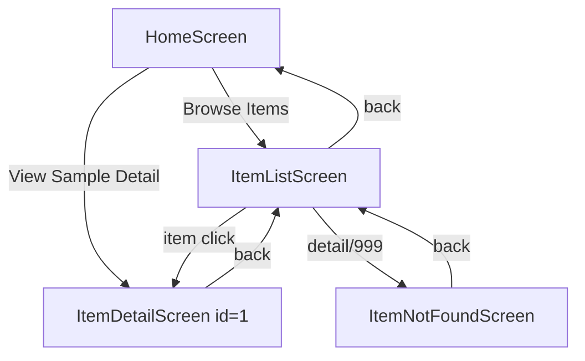
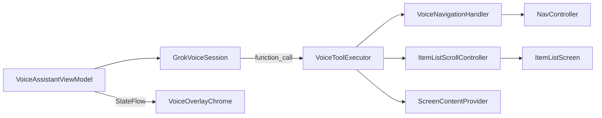

# Architecture

How the android-roborazzi app is structured and how the same UI is exercised by two different test harnesses.

## Runtime composition

```
MainActivity
  └── VoiceAssistantRoot
        ├── FuturisticBackground
        ├── AppNavHost (testTag: app_content)
        │     └── NavHost: home → items → detail/{itemId}
        └── VoiceOverlayChrome
              └── VoiceTranscriptOverlay (connect, status, transcript, tools)
```

[`VoiceAssistantRoot.kt`](../app/src/main/java/com/example/roborazzidemo/ui/VoiceAssistantRoot.kt) is the **composition root**. It creates and wires:

| Object | Created in | Used by |
|--------|-----------|---------|
| `NavHostController` | `rememberNavController()` | `AppNavHost`, `VoiceNavigationHandler` |
| `ItemListScrollController` | `remember { }` | `ItemListScreen`, `VoiceToolExecutor` |
| `VoiceNavigationHandler` | `remember(navController)` | `VoiceToolExecutor` |
| `VoiceToolExecutor` | `remember(...)` | `VoiceAssistantViewModel` |
| `VoiceAssistantViewModel` | `viewModel(Factory(...))` | `VoiceOverlayChrome` |

There is no DI framework. Dependencies are constructed manually and passed explicitly.

## Navigation graph

Routes are defined in [`NavRoutes.kt`](../app/src/main/java/com/example/roborazzidemo/navigation/NavRoutes.kt):

| Route | Pattern | Screen |
|-------|---------|--------|
| Home | `"home"` | `HomeScreen` (start destination) |
| Items | `"items"` | `ItemListScreen` |
| Detail | `"detail/{itemId}"` | `ItemDetailScreen` or `ItemNotFoundScreen` |

[`AppNavHost.kt`](../app/src/main/java/com/example/roborazzidemo/AppNavHost.kt) wires navigation callbacks:

- Home → Items: `navigate(NavRoutes.Items)`
- Home → Detail: `navigate(NavRoutes.detail(1))`
- Items → Detail: `navigate(NavRoutes.detail(item.id))`
- Back: `popBackStack()`

Item data comes from [`Item.kt`](../app/src/main/java/com/example/roborazzidemo/model/Item.kt) — 25 sample items with titles and descriptions. `findItemById()` resolves detail routes; invalid IDs show `ItemNotFoundScreen`.



## Semantics registry (voice-readable UI)

Each `NavHost` destination wraps its content in [`TrackScreenContent`](../app/src/main/java/com/example/roborazzidemo/semantics/TrackScreenContent.kt), which registers a list of [`ScreenElement`](../app/src/main/java/com/example/roborazzidemo/semantics/ScreenElement.kt) objects (role, text, optional description) into [`ScreenContentRegistry`](../app/src/main/java/com/example/roborazzidemo/semantics/ScreenContentRegistry.kt).

When the voice agent calls `describe_screen`, [`ScreenContentProvider`](../app/src/main/java/com/example/roborazzidemo/semantics/ScreenContentProvider.kt) returns JSON from the registry — the model reads structured UI content without traversing the Compose tree.

**Convention:** add `TrackScreenContent` to every new destination with accurate `ScreenElement` entries.

## Voice overlay integration

The voice layer sits **on top of** the same nav graph, not in a separate activity:



[`VoiceAssistantViewModel`](../app/src/main/java/com/example/roborazzidemo/viewmodel/VoiceAssistantViewModel.kt) implements `VoiceSessionListener` and maps WebSocket events to `VoiceUiState` (status, transcript, turn phase, last tool).

## UI layers

| Layer | Path | Notes |
|-------|------|-------|
| Screens | `ui/HomeScreen.kt`, `ItemListScreen.kt`, `ItemDetailScreen.kt`, `ItemNotFoundScreen.kt` | Futuristic Nexus/LCARS styling |
| Theme | `theme/`, `ui/futuristic/` | Shared visual system used in Roborazzi goldens |
| Voice chrome | `ui/VoiceOverlayChrome.kt`, `VoiceTranscriptOverlay.kt` | Floating overlay; semantics for E2E |
| Top bar | `ui/AppTopBar.kt` | Back navigation on list/detail screens |

## How the same UI is tested two ways

The navigation graph and screens are shared. The test harnesses differ:

| Aspect | Roborazzi (`src/test`) | Voice E2E (`src/androidTest`) |
|--------|------------------------|-------------------------------|
| Renders UI via | `ComposeContentTestRule.setContent` | `ActivityScenarioRule(MainActivity)` |
| Voice overlay | `VoiceUiState.RoborazziDisconnected` (static) | Live session via Connect toggle |
| Navigation | Compose Test clicks (`onNodeWithText`) | Voice commands → tool execution |
| Assertions | Pixel comparison + `assertIsDisplayed` | UiAutomator semantics + turn order |
| Network | None | Live xAI WebSocket |

Roborazzi tests render individual screens or `AppNavHost` in isolation with mocked callbacks. E2E drives the full running app through voice injects and validates agent behavior end-to-end.

## Source set layout

```
app/src/
├── main/           # Production code
├── test/           # JVM: Roborazzi + unit tests
├── androidTest/    # Instrumented: voice E2E
├── debug/          # Debug-only: VoiceDebugReceiver, TestPcmSpeechGenerator
└── screenshots/    # Committed WebP golden images
```

## Adding a new screen (checklist)

1. Create composable in `ui/`.
2. Add route to `NavRoutes.kt` and destination in `AppNavHost.kt` with `TrackScreenContent`.
3. If voice-navigable: extend `VoiceNavigationHandler` and `VoiceToolDefinitions`.
4. Add Roborazzi test in `src/test/` with a `GoldenImages` constant.
5. If user-facing via voice: add E2E step in `VoiceAppIntegrationTest` and robot helpers in `VoiceAppTestRobot`.
6. Record and commit golden images.