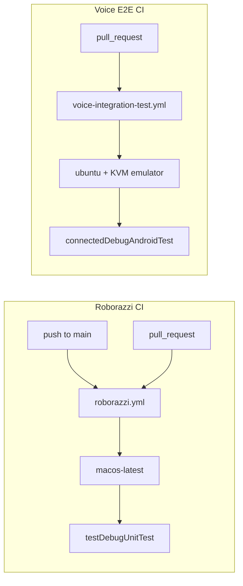

# CI and development

Build setup, CI workflows mapped to test strategies, helper scripts, and change checklists.

## Build setup

| Setting | Value |
|---------|-------|
| Module | Single `:app` module |
| JDK | 21 (toolchain + compile options) |
| Kotlin | 2.4.0 |
| AGP | 9.2.1 |
| Gradle | 9.4.1 |
| `minSdk` | 24 |
| `compileSdk` / `targetSdk` | 37 |
| Package | `com.example.roborazzidemo` |

Key files:

- [`build.gradle.kts`](../build.gradle.kts) — root plugins
- [`app/build.gradle.kts`](../app/build.gradle.kts) — app config, Roborazzi output dir, dependencies
- [`gradle/libs.versions.toml`](../gradle/libs.versions.toml) — version catalog
- [`settings.gradle.kts`](../settings.gradle.kts) — `include(":app")`

### API key (compile time)

```kotlin
val apiKey = providers.environmentVariable("XAI_API_KEY").orElse("no-api-key").get()
buildConfigField("String", "XAI_API_KEY", "\"$apiKey\"")
```

The key is baked into `BuildConfig.XAI_API_KEY` at build time. Set `XAI_API_KEY` in the environment before `./gradlew` when building for voice features or E2E. Placeholder `no-api-key` causes the integration test to fail fast.

## CI maps to test strategy



### Roborazzi — [`.github/workflows/roborazzi.yml`](../.github/workflows/roborazzi.yml)

| | |
|---|---|
| Trigger | Push to `main`, all PRs |
| Runner | `macos-latest`, JDK 21 |
| Command | `./gradlew :app:testDebugUnitTest --stacktrace` |
| On failure | `roborazzi-diffs` artifact (compare images, HTML report, test results) |
| PR comments | [`roborazzi-comment.yml`](../.github/workflows/roborazzi-comment.yml) posts inline `*_compare.webp` on failure |

No secrets required.

### Voice E2E — [`.github/workflows/voice-integration-test.yml`](../.github/workflows/voice-integration-test.yml)

| | |
|---|---|
| Trigger | PRs only |
| Runner | `ubuntu-latest`, JDK 21, KVM |
| Secret | `XAI_API_KEY` (fails fast if missing) |
| Emulator | API 34, Pixel 6, x86_64, `disable-animations: true` |
| Flow | Cache warmup → emulator boot → voice integration test |
| On failure | `voice-integration-test-results` artifact |
| Timeout | 45 minutes |

## Scripts

| Script | Purpose |
|--------|---------|
| [`scripts/run-voice-integration-test.sh`](../scripts/run-voice-integration-test.sh) | Runs `VoiceAppIntegrationTest` via `connectedDebugAndroidTest`; streams `VoiceE2E` logcat; fails if tests skipped |
| [`scripts/run-gradle-cache-warmup.sh`](../scripts/run-gradle-cache-warmup.sh) | Assembles debug + androidTest APKs without emulator (CI cache warmup) |
| [`scripts/verify-buildconfig-api-key.sh`](../scripts/verify-buildconfig-api-key.sh) | Verifies debug APK has live API key (not `no-api-key`); never prints the secret |

All voice scripts require `XAI_API_KEY` in the environment.

## Source sets

```
app/src/
├── main/           # Production Compose UI, voice session, navigation
├── test/           # JVM: Roborazzi screenshot tests + unit tests
├── androidTest/    # Instrumented: VoiceAppIntegrationTest + robot
├── debug/          # Debug-only: VoiceDebugReceiver, TestSpeechSpeaker
└── screenshots/    # Committed WebP golden images (Roborazzi output)
```

| Source set | Build variant | Used by |
|------------|---------------|---------|
| `main` | All | App runtime |
| `test` | Unit test task | Roborazzi, JVM unit tests |
| `androidTest` | Instrumented test task | Voice E2E |
| `debug` | Debug builds only | Debug broadcasts, TTS test harness |
| `screenshots` | N/A (committed assets) | Roborazzi golden comparison |

## Common commands

```bash
# Build and install
export XAI_API_KEY=your-key-here   # optional for UI-only work
./gradlew :app:installDebug

# Roborazzi verify
./gradlew :app:testDebugUnitTest

# Roborazzi record
./gradlew :app:testDebugUnitTest \
  -Proborazzi.test.verify=false \
  -Proborazzi.test.record=true

# Voice E2E
./gradlew :app:connectedDebugAndroidTest \
  -Pandroid.testInstrumentationRunnerArguments.class=com.example.roborazzidemo.voice.VoiceAppIntegrationTest

# CI-local voice script (with emulator running)
bash scripts/run-voice-integration-test.sh
```

## Checklist: add a new navigation route

1. Add route constant to [`NavRoutes.kt`](../app/src/main/java/com/example/roborazzidemo/navigation/NavRoutes.kt).
2. Add `composable` destination in [`AppNavHost.kt`](../app/src/main/java/com/example/roborazzidemo/AppNavHost.kt) with `TrackScreenContent`.
3. Create screen composable in `ui/`.
4. Extend `VoiceNavigationHandler` if voice-navigable.
5. Add `GoldenImages` constant + Roborazzi test.
6. Record and commit golden WebP.
7. Add E2E navigation step if voice-accessible.

## Checklist: change CI

| Change | Where |
|--------|-------|
| Roborazzi runner/command | `.github/workflows/roborazzi.yml` |
| PR diff comment behavior | `.github/workflows/roborazzi-comment.yml` |
| Emulator profile/API level | `.github/workflows/voice-integration-test.yml` `with:` block |
| Voice test class or args | `scripts/run-voice-integration-test.sh` |
| Cache warmup targets | `scripts/run-gradle-cache-warmup.sh` |
| API key validation | `scripts/verify-buildconfig-api-key.sh`, `app/build.gradle.kts` |

## Checklist: dependency or SDK bump

1. Update versions in [`gradle/libs.versions.toml`](../gradle/libs.versions.toml).
2. Run `./gradlew :app:testDebugUnitTest` — Roborazzi may need golden re-recording after rendering changes.
3. Run voice E2E locally if Roborazzi passes but voice/audio behavior may shift.
4. Verify both CI workflows still pass on PR.