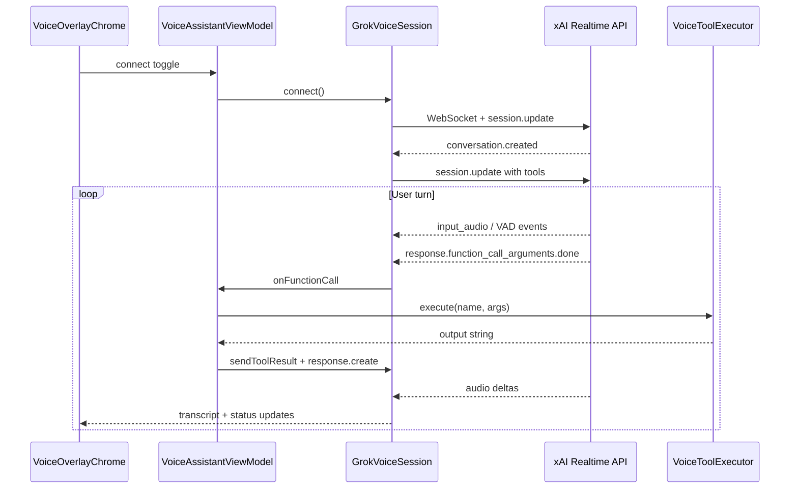

# Voice assistant

Grok Voice Agent overlay — realtime session, client tools, audio handling, and debug injects.

## Overview

The app connects to the [xAI Voice Agent API](https://docs.x.ai/developers/model-capabilities/audio/voice-agent) via WebSocket. A floating overlay provides connect/disconnect, live transcript, mic level, status, and last-tool display.

Session config: model `grok-voice-latest`, voice `eve`, server VAD, PCM 24 kHz, instruction **"Answer brief."**

## Architecture



## Key files

| File | Responsibility |
|------|----------------|
| [`GrokVoiceSession.kt`](../app/src/main/java/com/example/roborazzidemo/voice/GrokVoiceSession.kt) | WebSocket client, PCM capture/playback, event handling, turn gating, emulator half-duplex |
| [`VoiceSessionUpdateBuilder.kt`](../app/src/main/java/com/example/roborazzidemo/voice/VoiceSessionUpdateBuilder.kt) | `session.update` JSON: model, VAD, instructions, tools |
| [`VoiceToolDefinitions.kt`](../app/src/main/java/com/example/roborazzidemo/voice/VoiceToolDefinitions.kt) | Tool schemas sent to xAI |
| [`VoiceToolExecutor.kt`](../app/src/main/java/com/example/roborazzidemo/voice/VoiceToolExecutor.kt) | Client-side tool dispatch |
| [`VoiceNavigationHandler.kt`](../app/src/main/java/com/example/roborazzidemo/navigation/VoiceNavigationHandler.kt) | `navigate_to_screen`, `navigate_back` |
| [`VoiceAssistantViewModel.kt`](../app/src/main/java/com/example/roborazzidemo/viewmodel/VoiceAssistantViewModel.kt) | `VoiceSessionListener`, `VoiceUiState`, debug bridge wiring |
| [`PcmAudioCapture.kt`](../app/src/main/java/com/example/roborazzidemo/voice/PcmAudioCapture.kt) | Mic streaming (xAI-aligned PCM16 20 ms frames); AEC on hardware; drain-while-muted |
| [`PcmAudioPlayback.kt`](../app/src/main/java/com/example/roborazzidemo/voice/PcmAudioPlayback.kt) | Speaker output, barge-in flush, playback-idle drain for turn gate |
| [`VoiceAudioRoute.kt`](../app/src/main/java/com/example/roborazzidemo/voice/VoiceAudioRoute.kt) | `MODE_IN_COMMUNICATION` on devices only (skipped on AVD) |
| [`VoiceDeviceHints.kt`](../app/src/main/java/com/example/roborazzidemo/voice/VoiceDeviceHints.kt) | Emulator vs device strategy: sources, VAD, half-duplex, effects |

## Voice tools

| Tool | Where it runs | Purpose |
|------|---------------|---------|
| `web_search` | xAI server | Weather, news, live web facts |
| `navigate_to_screen` | App | Navigate to `home`, `items`, or `detail` (+ optional `item_id`) |
| `navigate_back` | App | Pop navigation stack |
| `open_list_item` | App | Scroll list to 1-based item index and highlight |
| `describe_screen` | App | Return structured UI tree JSON from `ScreenContentRegistry` |

### Tool execution paths

**Server tools** (`web_search`): acknowledged with `function_call_output: {"status":"completed"}` — no `response.create`; speech continues in the same turn.

**Client tools** (`navigate_*`, `open_list_item`, `describe_screen`):

1. `VoiceAssistantViewModel.onFunctionCall()`
2. `VoiceToolExecutor.execute(name, arguments)`
3. `GrokVoiceSession.sendToolResult(output, callId)`
4. `conversation.item.create` + `response.create` for follow-up speech

Session instructions tell the model to call `describe_screen` before guessing UI content, and `web_search` for live facts.

## Emulator vs physical device

Voice behaves very differently by platform. [`VoiceDeviceHints.kt`](../app/src/main/java/com/example/roborazzidemo/voice/VoiceDeviceHints.kt) selects the strategy.

### Emulator: half-duplex (no echo cancellation)

Android emulators lack working AEC. On a typical Mac setup:

```
Grok speaks → host speakers → Mac mic → AVD virtual mic → Grok hears itself → echo loop
```

**Mitigations in this app** ([`VoiceDeviceHints`](../app/src/main/java/com/example/roborazzidemo/voice/VoiceDeviceHints.kt)):

- **Greeting first:** open mic only after Hello PCM has fully drained (concurrent `AudioRecord` silences AVD speakers)
- Mute uplink while Grok is speaking (`response.created` / playback drain)
- Keep reading `AudioRecord` while muted (drain, do not append) so buffers do not overflow
- Resume after playback drains + ~450 ms tail
- Skip `MODE_IN_COMMUNICATION` (it often silences the virtual mic)
- Skip platform AEC/NS/AGC (often available-but-broken on AVDs)
- Raise `STREAM_MUSIC` volume if too low (USAGE_MEDIA playback)
- Fall back capture sources: `VOICE_COMMUNICATION` → `MIC` → `DEFAULT` (quiet probe no longer fails capture)
- Stricter server VAD (`threshold=0.7`, `silence_duration_ms=500`) to reduce false commits
- Overlay hint when sustained silence is detected (`voice-emulator-mic-hint`)
- No barge-in on emulator

Expect turn-taking: wait for **Listening — ask a question** before speaking.

**Tips for AVD testing:**

- `scripts/start-voice-emulator.sh` (boots API 34 AVD + `adb emu avd hostmicon`)
- Or `scripts/enable-emulator-mic.sh` on an already-running emulator
- Extended Controls → Microphone → enable *Virtual microphone uses host audio input*
- Use headphones to prevent speaker → mic feedback
- Lower host mic gain in macOS Sound settings
- For CI/scripted runs, use TTS + `VOICE_SPOKEN` injects (see [voice-e2e-testing.md](voice-e2e-testing.md))

### Physical device: full-duplex (xAI demo aligned)

On real hardware (following the [xAI Android Voice demo](https://github.com/xai-org/xai-cookbook/tree/main/Android/VoiceApiAndroidExample)):

- **Audio route:** `MODE_IN_COMMUNICATION` with speakerphone on
- **Mic source:** `VOICE_COMMUNICATION` with platform AEC, noise suppression, AGC
- **Full duplex:** mic streams continuously; nothing muted client-side for assistant speech
- **Barge-in:** speaking while Grok talks flushes playback and takes over
- **Server VAD:** defaults (`type=server_vad` only); client does not implement end-of-utterance

Use a real device when validating natural voice UX.

## Debug broadcasts (debug builds only)

Registered in [`VoiceDebugReceiver.kt`](../app/src/debug/java/com/example/roborazzidemo/voice/VoiceDebugReceiver.kt), wired through [`VoiceDebugBridge.kt`](../app/src/main/java/com/example/roborazzidemo/voice/VoiceDebugBridge.kt):

| Action | Extra | Purpose |
|--------|-------|---------|
| `com.example.roborazzidemo.VOICE_SPOKEN` | `text` | Inject spoken user turn (E2E primary path) |
| `com.example.roborazzidemo.VOICE_TEXT` | `text` | Inject text turn (direct-speech debug) |
| `com.example.roborazzidemo.VOICE_DISCONNECT` | — | Disconnect session |
| `com.example.roborazzidemo.VOICE_TEST_ANNOUNCE` | `text`, optional `speech_mode` (`beep`/`tts`) | E2E user-turn cue (beep default) |
| `com.example.roborazzidemo.VOICE_TEST_SPEECH_BEGIN/END` | — | Mute mic during TTS playback |

`VoiceDebugBridge` is populated by `VoiceAssistantViewModel` on connect and cleared on disconnect.

## Setup

```bash
export XAI_API_KEY=your-key-here
./gradlew :app:installDebug
```

Run on emulator or device with microphone access. Toggle **Connect** on the overlay and grant **Record audio**.

## Checklist: add a new voice tool

1. Add tool schema to [`VoiceToolDefinitions.toolsJson()`](../app/src/main/java/com/example/roborazzidemo/voice/VoiceToolDefinitions.kt).
2. Add dispatch case in [`VoiceToolExecutor.execute()`](../app/src/main/java/com/example/roborazzidemo/voice/VoiceToolExecutor.kt).
3. Implement handler (navigation, scroll, registry, or new service).
4. Update session instructions in [`VoiceSessionUpdateBuilder`](../app/src/main/java/com/example/roborazzidemo/voice/VoiceSessionUpdateBuilder.kt) so the model knows when to call it.
5. Ensure `VoiceAssistantViewModel` surfaces `lastToolName` for E2E semantics (`voice-last-tool-{name}`).
6. Add E2E step in [`VoiceAppIntegrationTest`](../app/src/androidTest/java/com/example/roborazzidemo/voice/VoiceAppIntegrationTest.kt) with `speakAndWaitForTool`.
7. If the tool changes visible UI: add Roborazzi coverage (see [screenshot-testing.md](screenshot-testing.md)).
8. If the tool needs screen context: extend `TrackScreenContent` elements in [`AppNavHost.kt`](../app/src/main/java/com/example/roborazzidemo/AppNavHost.kt).