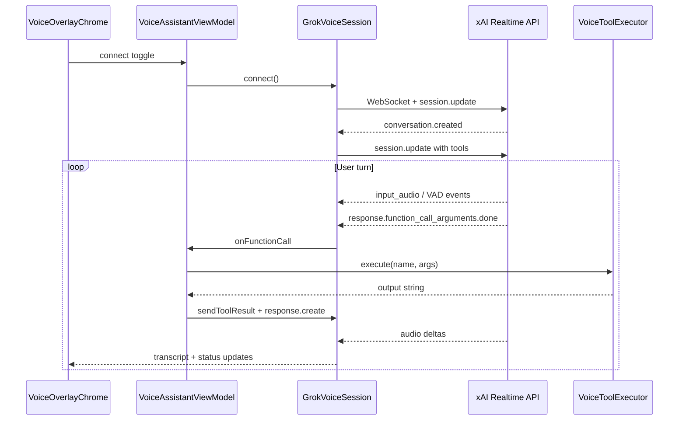

# Voice assistant

Grok Voice Agent overlay — realtime session, client tools, audio handling, and debug injects.

## Overview

The app connects to the [xAI Voice Agent API](https://docs.x.ai/developers/model-capabilities/audio/voice-agent) via WebSocket. A floating overlay provides connect/disconnect, live transcript, mic level, status, and last-tool display.

Session config: model `grok-voice-latest`, voice `eve`, server VAD, PCM 24 kHz, instruction **"Answer brief."**

## Architecture



## Key files

| File | Responsibility |
|------|----------------|
| [`GrokVoiceSession.kt`](../app/src/main/java/com/example/roborazzidemo/voice/GrokVoiceSession.kt) | WebSocket client, PCM capture/playback, event handling, turn gating, half-duplex |
| [`VoiceSessionUpdateBuilder.kt`](../app/src/main/java/com/example/roborazzidemo/voice/VoiceSessionUpdateBuilder.kt) | `session.update` JSON: model, VAD, instructions, tools |
| [`VoiceToolDefinitions.kt`](../app/src/main/java/com/example/roborazzidemo/voice/VoiceToolDefinitions.kt) | Tool schemas sent to xAI |
| [`VoiceToolExecutor.kt`](../app/src/main/java/com/example/roborazzidemo/voice/VoiceToolExecutor.kt) | Client-side tool dispatch |
| [`VoiceNavigationHandler.kt`](../app/src/main/java/com/example/roborazzidemo/navigation/VoiceNavigationHandler.kt) | `navigate_to_screen`, `navigate_back` |
| [`VoiceAssistantViewModel.kt`](../app/src/main/java/com/example/roborazzidemo/viewmodel/VoiceAssistantViewModel.kt) | `VoiceSessionListener`, `VoiceUiState`, debug bridge wiring |
| [`PcmAudioCapture.kt`](../app/src/main/java/com/example/roborazzidemo/voice/PcmAudioCapture.kt) | Mic streaming with AEC on hardware |
| [`PcmAudioPlayback.kt`](../app/src/main/java/com/example/roborazzidemo/voice/PcmAudioPlayback.kt) | Grok assistant speaker output, barge-in flush, `STREAM_MUSIC` boost on emulator |
| [`PcmChunkMirror.kt`](../app/src/main/java/com/example/roborazzidemo/voice/PcmChunkMirror.kt) | Debug hook: mirror E2E user PCM frames to speaker |
| [`TestPcmMirrorPlayback.kt`](../app/src/debug/java/com/example/roborazzidemo/voice/TestPcmMirrorPlayback.kt) | Debug `AudioTrack` implementation of `PcmChunkMirror` |
| [`TestPcmSpeechGenerator.kt`](../app/src/debug/java/com/example/roborazzidemo/voice/TestPcmSpeechGenerator.kt) | E2E TTS → WAV → PCM24k synthesis |
| [`VoiceAudioRoute.kt`](../app/src/main/java/com/example/roborazzidemo/voice/VoiceAudioRoute.kt) | `MODE_IN_COMMUNICATION` routing |
| [`VoiceDeviceHints.kt`](../app/src/main/java/com/example/roborazzidemo/voice/VoiceDeviceHints.kt) | Emulator vs device strategy selection |

## Voice tools

| Tool | Where it runs | Purpose |
|------|---------------|---------|
| `web_search` | xAI server | Weather, news, live web facts |
| `navigate_to_screen` | App | Navigate to `home`, `items`, or `detail` (+ optional `item_id`) |
| `navigate_back` | App | Pop navigation stack |
| `open_list_item` | App | Scroll list to 1-based item index and highlight |
| `describe_screen` | App | Return structured UI tree JSON from `ScreenContentRegistry` |

### Tool execution paths

**Server tools** (`web_search`): acknowledged with `function_call_output: {"status":"completed"}` — no `response.create`; speech continues in the same turn.

**Client tools** (`navigate_*`, `open_list_item`, `describe_screen`):

1. `VoiceAssistantViewModel.onFunctionCall()`
2. `VoiceToolExecutor.execute(name, arguments)`
3. `GrokVoiceSession.sendToolResult(output, callId)`
4. `conversation.item.create` + `response.create` for follow-up speech

Session instructions tell the model to call `describe_screen` before guessing UI content, and `web_search` for live facts.

## Emulator vs physical device

Voice behaves very differently by platform. [`VoiceDeviceHints.kt`](../app/src/main/java/com/example/roborazzidemo/voice/VoiceDeviceHints.kt) selects the strategy.

### Emulator: half-duplex (no echo cancellation)

Android emulators lack working AEC. On a typical Mac setup:

```
Grok speaks → host speakers → Mac mic → AVD virtual mic → Grok hears itself → echo loop
```

**Mitigations in this app:**

- Mute mic while Grok is speaking (`response.created` / audio deltas)
- Resume after playback drains + ~450 ms tail
- Do **not** send `input_audio_buffer.clear` — server VAD owns committed audio
- No barge-in on emulator

Expect turn-taking: wait for **Listening — ask a question** before speaking.

**Tips for AVD testing:**

- Extended Controls → Microphone → enable *Virtual microphone uses host audio input*
- Use headphones to prevent speaker → mic feedback
- Lower host mic gain in macOS Sound settings
- For CI/scripted runs, use PCM inject via `VOICE_PCM_SPEAK` (see [voice-e2e-testing.md](voice-e2e-testing.md))

### Physical device: full-duplex

On real hardware (following the [xAI Android Voice demo](https://github.com/xai-org/xai-cookbook/tree/main/Android/VoiceApiAndroidExample)):

- **Audio route:** `MODE_IN_COMMUNICATION` with speakerphone on
- **Mic source:** `VOICE_COMMUNICATION` with platform AEC, noise suppression, AGC
- **Full duplex:** mic streams continuously; nothing muted client-side
- **Barge-in:** speaking while Grok talks flushes playback and takes over
- **Server VAD:** turn detection on server; client does not implement end-of-utterance

Use a real device when validating natural voice UX.

## Debug broadcasts (debug builds only)

Registered in [`VoiceDebugReceiver.kt`](../app/src/debug/java/com/example/roborazzidemo/voice/VoiceDebugReceiver.kt), wired through [`VoiceDebugBridge.kt`](../app/src/main/java/com/example/roborazzidemo/voice/VoiceDebugBridge.kt):

| Action | Extra | Purpose |
|--------|-------|---------|
| `com.example.roborazzidemo.VOICE_PCM_SPEAK` | `text`, optional `mirror_pcm` | Synthesize and stream user utterance as PCM (E2E primary path) |
| `com.example.roborazzidemo.VOICE_PCM_BYTES` | `pcm`, optional `mirror_pcm` | Stream raw PCM bytes (Base64) |
| `com.example.roborazzidemo.VOICE_TEXT` | `text` | Inject text turn (direct-speech debug) |
| `com.example.roborazzidemo.VOICE_DISCONNECT` | — | Disconnect session |
| `com.example.roborazzidemo.VOICE_TEST_WARMUP` | — | Warm up TTS engine for PCM synthesis |

`VoiceDebugBridge` is populated by `VoiceAssistantViewModel` on connect and cleared on disconnect.

### E2E audible user prompts (debug, local only)

When `mirror_pcm=true` is set on a PCM broadcast (driven by instrumentation arg `voiceE2eAudiblePrompts=true` in [`VoiceE2eConfig`](../app/src/androidTest/java/com/example/roborazzidemo/voice/support/VoiceE2eConfig.kt)), [`GrokVoiceSession`](../app/src/main/java/com/example/roborazzidemo/voice/GrokVoiceSession.kt) streams each `input_audio_buffer.append` frame to xAI **and** mirrors the identical frame to a local `AudioTrack` via [`TestPcmMirrorPlayback`](../app/src/debug/java/com/example/roborazzidemo/voice/TestPcmMirrorPlayback.kt). Grok replies remain on [`PcmAudioPlayback`](../app/src/main/java/com/example/roborazzidemo/voice/PcmAudioPlayback.kt). CI does not enable this path.

See [voice-e2e-testing.md](voice-e2e-testing.md) for runner arguments and examples.

## Setup

```bash
export XAI_API_KEY=your-key-here
./gradlew :app:installDebug
```

Run on emulator or device with microphone access. Toggle **Connect** on the overlay and grant **Record audio**.

## Checklist: add a new voice tool

1. Add tool schema to [`VoiceToolDefinitions.toolsJson()`](../app/src/main/java/com/example/roborazzidemo/voice/VoiceToolDefinitions.kt).
2. Add dispatch case in [`VoiceToolExecutor.execute()`](../app/src/main/java/com/example/roborazzidemo/voice/VoiceToolExecutor.kt).
3. Implement handler (navigation, scroll, registry, or new service).
4. Update session instructions in [`VoiceSessionUpdateBuilder`](../app/src/main/java/com/example/roborazzidemo/voice/VoiceSessionUpdateBuilder.kt) so the model knows when to call it.
5. Ensure `VoiceAssistantViewModel` surfaces `lastToolName` for E2E semantics (`voice-last-tool-{name}`).
6. Add E2E step in [`VoiceAppIntegrationTest`](../app/src/androidTest/java/com/example/roborazzidemo/voice/VoiceAppIntegrationTest.kt) with `speakAndWaitForTool`.
7. If the tool changes visible UI: add Roborazzi coverage (see [screenshot-testing.md](screenshot-testing.md)).
8. If the tool needs screen context: extend `TrackScreenContent` elements in [`AppNavHost.kt`](../app/src/main/java/com/example/roborazzidemo/AppNavHost.kt).